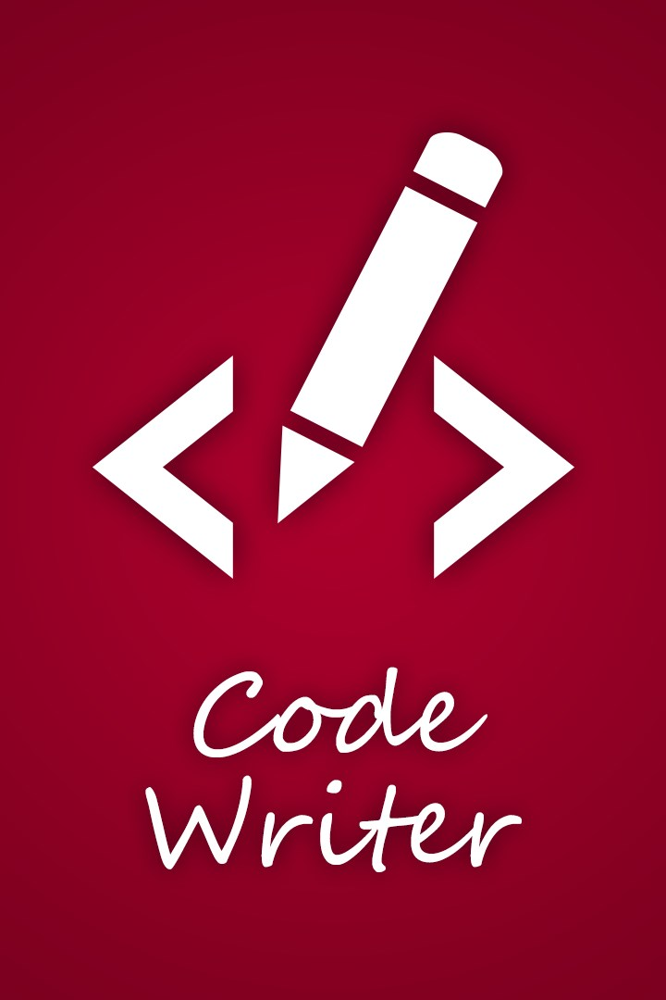

## Épisode 0 : comprendre le rôle des fichiers utilisés
Le but de chaque épisode est de présenter rapidement une notion ou un élément de la programmation en informatique. Dans
chaque épisode, il y a un exercice à réaliser afin de mettre en pratique et de comprendre le concept abordé.

Pour chaque épisode, il y a 2 répertoires : `exercice` et `solution`. Le répertoire `exercice` contient les fichiers
à modifier pour comprendre les notions abordées dans l'épisode. Le répertoire `solution` contient les fichiers
complets, la solution de l'exercice. Dans chaque répertoire, on retrouve les fichiers suivants :
* [episode.html](exercice/episode.html) : le fichier à ouvrir avec votre navigateur Internet (Firefox, Chrome, Safari,
  Microsoft Edge, etc.)
* [README.md](exercice/README.md) : instructions sur cet épisode (ce que vous êtes en train de lire)
* [javascript/episode.js](exercice/javascript/episode.js) : le code informatique qui est exécuté lorsque vous ouvrez le
  fichier `episode.html` avec votre navigateur.

### But de l'épisode
Le but de ce premier épisode est de comprendre le rôle de chaque fichier. À la fin de cet épisode, vous saurez dans quel
fichier se trouve le code informatique, comment le modifier et comment l'exécuter.

### Exercice
- Aller sur la page principale du projet ([celle-ci](https://github.com/info7tik/decouverte-programmation)) et cliquer
  sur le lien pour télécharger tous les épisodes
- Aller dans votre dossier `Téléchargements` et décompresser le fichier (par exemple, clic-droit > extraire tous les
  fichiers)
- Ouvrir le dossier `info7tik-decouverte-programmation`
- Ouvrir le fichier `episode.html` avec votre navigateur Internet
  * double-cliquer sur le fichier
- Le message `Hello world` devrait s'afficher à l'écran
- [pour Windows] Ouvrir le `Microsoft Store`. Dans la barre de recherche (en haut), écrire `code writer` et appuyer sur
  `Entrée`.
  * cliquer sur la case `Code Writer` qui a ce logo :
    
  * cliquer sur `Installer`
- Ouvrir le fichier `javascript/episode.js` avec un éditeur de texte (par exemple, `Code Writer` sous Windows ou `Gedit`
  sous Linux).
  * [pour Windows] Clic-droit sur le fichier > Ouvrir avec > Choisir `Code Writer`
  * [pour Linux] Double-clic sur le fichier
- Modifier le texte `Hello world` en `Bienvenue à la maison`.
- Sauvegarder le fichier
  * [pour Windows] dans `Code Writer`, cliquer sur la disquette en haut à gauche
  * [Linux] dans `Gedit`, cliquer sur `Sauvegarder` en haut à droite
- Actualiser la page Internet de votre navigateur en cliquant sur rafraichir ou en appuyant sur la touche F5.
